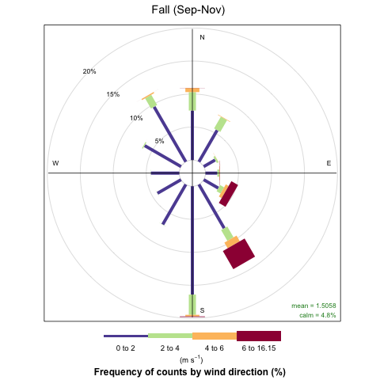

# Welcom to the MCRLdata Sandbox!

The [MCRLdata pipeline](https://mcrldata.pnnl.gov/) hosts and streams datasets collected by a wide range of environmental sensors located on the dock at Pacific Northwest National Laboratory's Sequim, WA campus, home to the Marine and Coastal Research Laboratory. The MCRLdata sandbox serves to extend and expand the functionality and capability of the MCRLdata pipeline by providing:

  1) **Real-time access** to historic MCRLdata datasets
  2) **Custom visualizations and analyses** supporting cross-domain research
  3) **Simple, modular tools** for users to create their own visualization or analysis tools
  4) **Training guides** to bring new users up to speed. 

If this is your first time here, and you have questions about the whys, whats, and hows, please start with the **sandbox_intro**

If you want to download MCRLdata datasets currently available on the sandbox, please visit **mcrl_data**

If you want to pull data programmatically into R, please see the **Accessing MCRLdata in R**

If you're new to coding but want to learn, check out our tutorials **here**

If you want to request a new capability or have any questions about the MCRLdata sandbox, please open a Github issue!

PR private notes: https://docs.google.com/document/d/1tXO-z3eQjqIRmyJPHZh_fS9__I04BJXTfCVrjMFlHZE/edit?tab=t.0

Progress tracking: https://docs.google.com/document/d/1QdxCAVCirGWI2zWxxsvcHiCyO30AkpuWzAlInB3Ff7U/edit?tab=t.0

# Wind Rose Plots

# Wind Rose Plots

  

  

    
    
  

  

    
    
  

