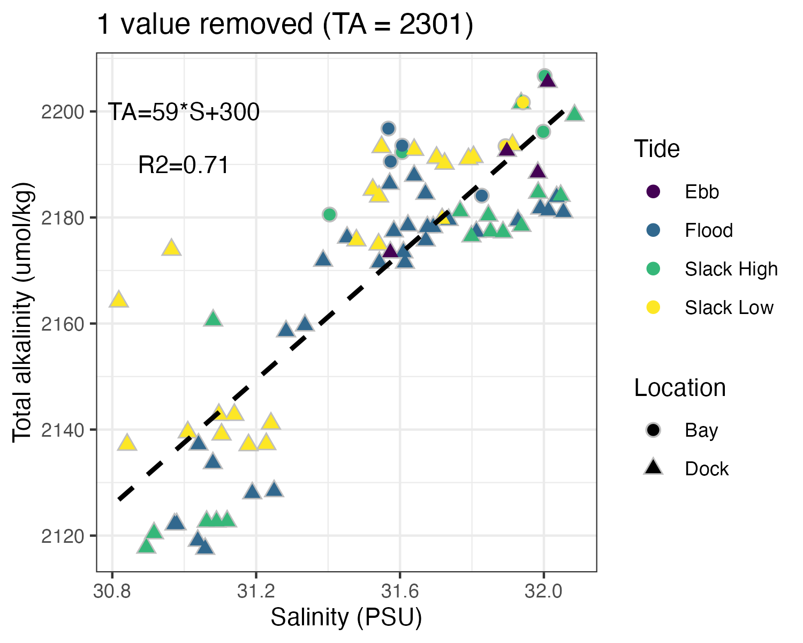
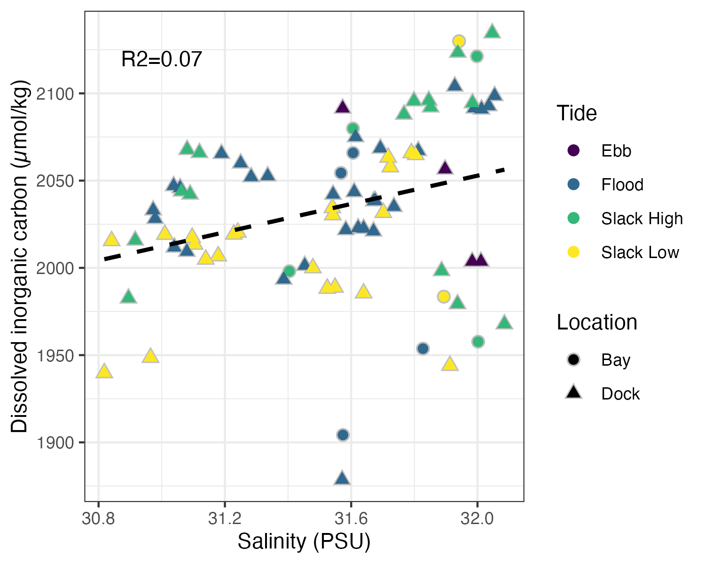
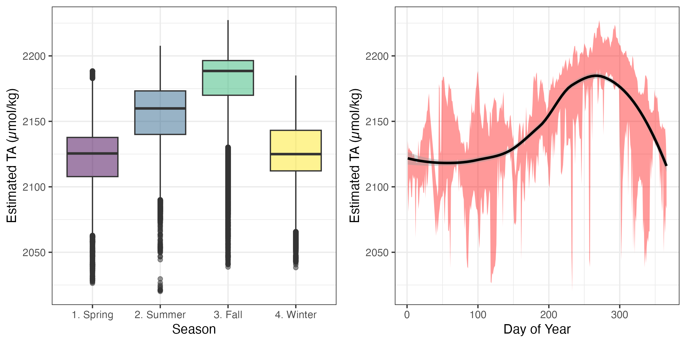

```{r setup, include=FALSE}
knitr::opts_chunk$set(echo = F,
                      warning = F, 
                      message = F)
```


This markdown summarizes currently available carbonate chemistry, focusing on total alkalinity (TA) and dissolved inorganic carbon (DIC) as key parameters. These data originated from Jessica Cross's LDRD work to capture natural variability envelopes of carbonate chemistry within Sequim Bay, and provide valuable baseline information.

## TA as a function of salinity

TA generally positively correlates with salinity in coastal zones where freshwater and saltwater mix, like Sequim Bay. Across available samples, this relationship is strong (R2 = 0.71), indicating that for every increase in salinity by one practical salinity unit (PSU), TA is estimated to increase ~59 umol/kg. While this relationship clearly varies, and does not necessarily account for seasonal or interannual variation, it provides a handy first estimate for TA, which requires laboratory analysis, via salinity, which is readily measured in-situ at high resolution


## Salinity vs DIC

Contrasting TA, DIC is not expected to correlate strongly salinity, and results support this expectation. Although there is an apparent increase in DIC with increasing salinity, this relationship is weak (R2=0.07).




## Estimated seasonality of TA

Using this relationship, we can estimate TA based on salinity. Following salinity, estimated TA is highest in the fall and lowest during spring and winter, with a peak in late October. 



## 


