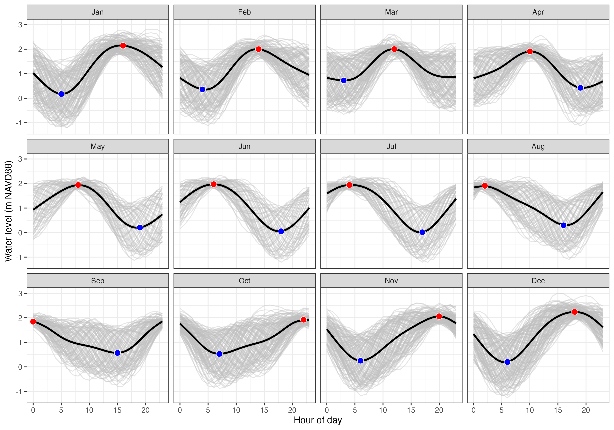

```{r setup, include=FALSE}
knitr::opts_chunk$set(echo = F, 
                      message = F, 
                      warning = F)
```

## Purpose

The datasets collected by the MCRLdata pipeline comprise a comprehensive suite of aquatic and meterological datasets that are useful across the MCRL mission space. This markdown provides a brief summary of seasonal patterns for a range of parameters deemed of most use to boating ops, but also of potential use to various research activities. This content is targeted to folks familiar with the system, but with just enough detail that folks not familiar will hopefully understand.  


## Water levels

Tides in Sequim Bay are semi-diurnal, meaning two high tides per day, but this pattern is often muted such that tides appear closer to diurnal. Water levels change roughly 2-3 meters between high and low tides, though this varies considerably between spring spring tides.

Seasonally, high tides generally occur between noon and the early afternoon in Jan-April, and generally get earlier, occuring near midnight in September. *Note that all times are in PST, and do not account for daylight savings. Low tides are generally occure in the afternoon / early evening in the summer.



## Water velocities

**TBD on getting velocity data organized**

## Annual Wind

Wind speeds average 1.7 m/s, ranging from calm (4% of the time) to >16 m/s. Strongest winds are to the SE, and most common wind directions are S/SE followed by NW/N/NE. 


## Seasonal Wind {.tabset}

Seasonal Summary (click tabs below for seasonal plots): 
  - Spring - avg: 1.9 m/s, calm: 2.9%, most common: N/S, strongest: SE
  - Summer - avg: 1.4 m/s, calm: 4.1%, most common: N, strongest: N
  - Fall - avg: 1.5 m/s, calm: 4.8%, most common: S, strongest: SE
  - Winter - avg: 1.8 m/s, calm: 3.6%, most common: S, strongest: SE


### Spring


### Summer


### Fall


### Winter


##

## Air and water temperatures

**coming soon once I clean em**


## Photosyntheticially Active Radiation

**coming soon once I clean em**


## Salinity

**coming soon once I clean em**


## Chlorophyll and Dissolved Oxygen 

**stretch goal**


