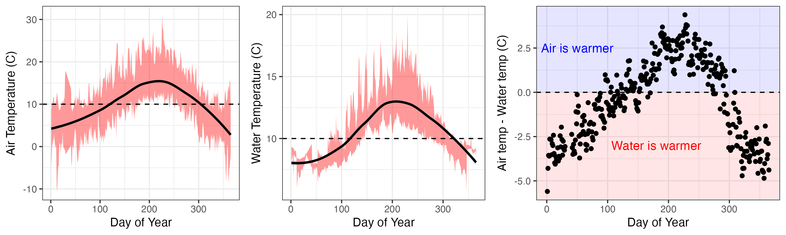

```{r setup, include=FALSE}
knitr::opts_chunk$set(echo = F, 
                      message = F, 
                      warning = F)
```

## Purpose

The datasets collected by the MCRLdata pipeline comprise a comprehensive suite of aquatic and meterological datasets that are useful across the MCRL mission space. **This markdown provides a brief summary of seasonal patterns for a range of parameters deemed of most use to boating ops**, but also of potential use to various research activities. This content is targeted to folks familiar with the system, but with just enough detail that folks not familiar will hopefully understand.

## Water levels

Tides in Sequim Bay are semi-diurnal, meaning two high tides per day, but this pattern is often muted such that tides appear closer to diurnal. Water levels change roughly 2-3 meters between high and low tides, though this varies considerably between spring spring tides.

Seasonally, high tides generally occur between noon and the early afternoon in Jan-April, and generally get earlier, occuring near midnight in September. Low tides are generally occur in the afternoon / early evening in the summer (*Note that all times are in PST, and do not account for daylight savings*).

 **Figure:** tidal water levels by hour of the day, faceted by month of year, showing individual daily water level patterns (gray lines), average daily patterns (black lines), and average time of day for high tide (red dots) and low tide (blue dots).

## Water velocities

Water velocities average 0.5-0.7 m/s throughout the year, and are generally higher during the summer and lower during the winter. Highest tidal velocities are generally around 1 m/s, and low velocities are around 0.2 m/s. The relationship between water velocities and water levels show velocities are generally higher at lower water levels, although there is considerable variation in this relationship.


-   **Left figure:** the relationship between water levels and water velocities
-   **Right figure:** Mean (black line) and mean +/- 1 standard deviation (gray ribbon) values for water velocities by day of year

## Annual Wind

Wind speeds average 1.7 m/s, ranging from calm (4% of the time) to \>16 m/s. Strongest winds are to the SE, and most common wind directions are S/SE followed by NW/N/NE.


**Figure:** Wind rose plot showing the frequency (circular %s) of wind speeds (size/color of bars) and direction (shown by compass)

## Seasonal Wind

-   Spring - avg: 1.9 m/s, calm: 2.9%, most common: N/S, strongest: SE
-   Summer - avg: 1.4 m/s, calm: 4.1%, most common: N, strongest: N
-   Fall - avg: 1.5 m/s, calm: 4.8%, most common: S, strongest: SE
-   Winter - avg: 1.8 m/s, calm: 3.6%, most common: S, strongest: SE

<!-- Method 1: HTML Table (Most Compatible) -->

|                                                     |                                                     |
|------------------------------------|------------------------------------|
| {alt="Spring"} | {alt="Summer"} |
| {alt="Fall"}       | {alt="Winter"} |

## Air and water temperatures

Average air temperatures span \~5ºC during the winter to \~15ºC during the summer, with daily ranges (max - min) of \~5ºC during the winter to \~8ºC during the summer. Daily highs typically occur later in the spring (15:00) and summer (16:00) than fall and winter (14:00), while daily lows are consistently 4:00-5:00.

Water temperatures follow a similar pattern as air temperatures, and are generally warmer than air temperatures during the summer, and colder than air temperatures during the winter.



-   **Left figure:** Mean (black line) and mean +/- 1 standard deviation (red ribbon) air temperature by day of year
-   **Middle figure:** Mean (black line) and mean +/- 1 standard deviation (red ribbon) water temperature by day of year
-   **Right figure:** The difference between air and water temperatures by day of year

### Salinity

Salinity exhibits some seasonality, and is generally lower in the winter and spring, and generally higher in the sumemr and fall. This variation is relatively small for a coastal system, ranging from \~30-32 PPT through most of the year. The relationship between salinity and season can be viewed as a hysteresis loop in relation to air temperature.


-   **Left figure:** Mean (black line) and mean +/- 1 standard deviation (red ribbon) salinity by day of year
-   **Right figure:** The relationship between mean salinity and mean air temperatures by day of year
