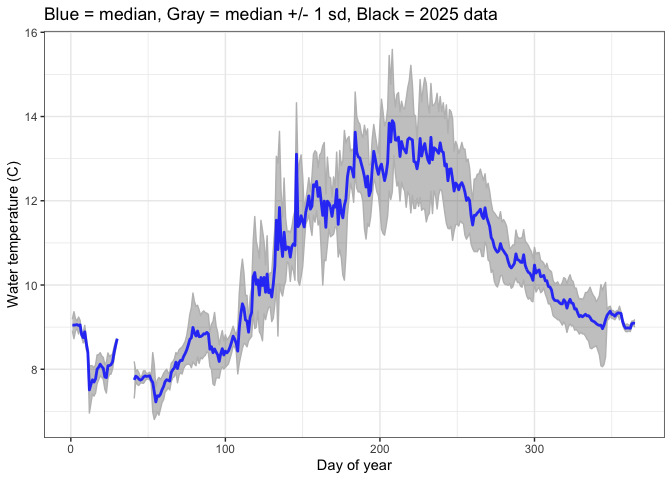
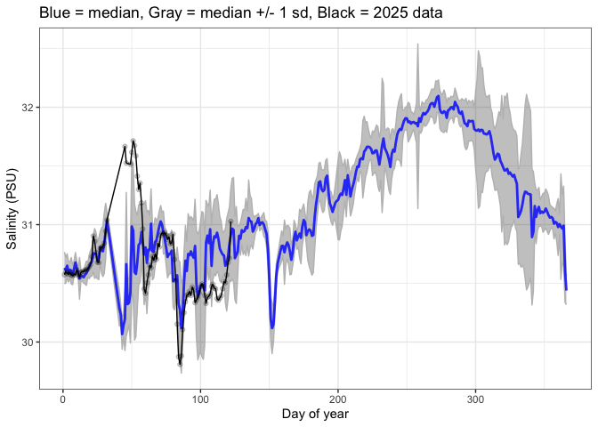
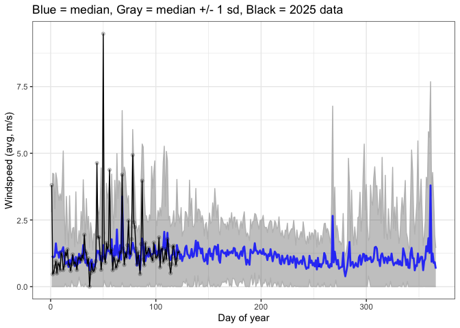
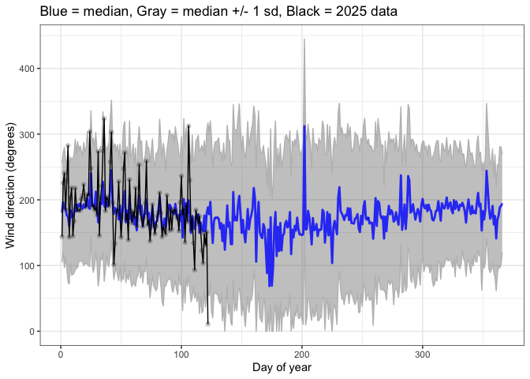
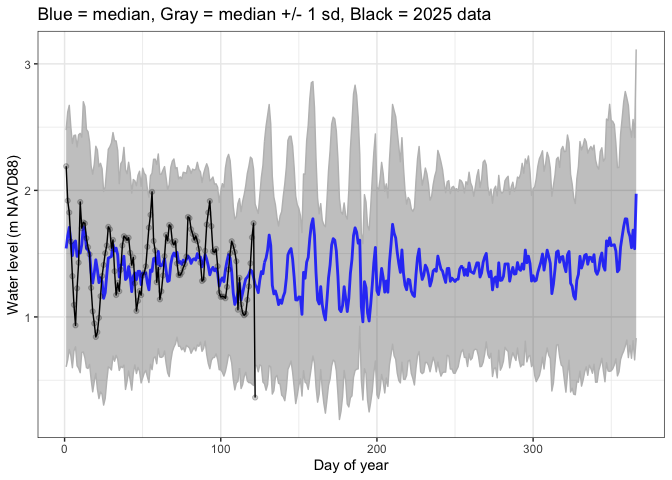
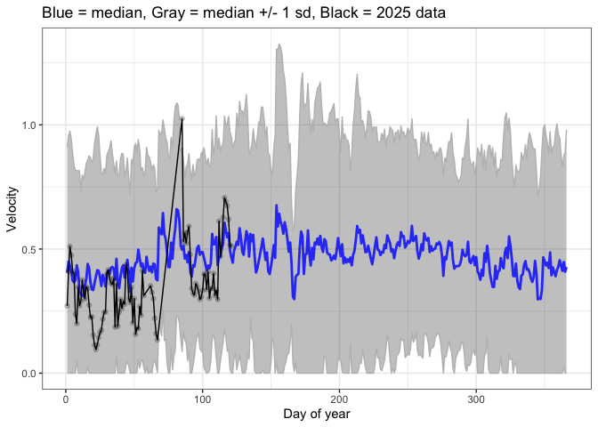

Sequim Bay natural variability envelopes
================
PR
2025-07-18

## Water temperature

<!-- -->

## Salinity

<!-- -->

## Windspeed (avg)

<!-- -->

## Wind direction

Note that \>360 degrees is impossible, reflects large standard
deviations, and should not be interpreted.

<!-- -->

## Tidal water levels

<!-- -->

## ADCP - tidal velocities

<!-- -->
